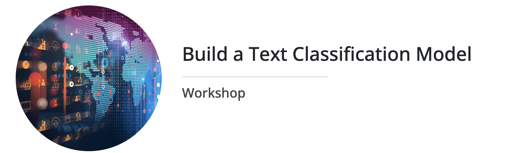

# Workshop: Text Classification

## Session Schedule
- :date: **Date**: July 8th, 2022
- :alarm_clock: **Time**: 1430 IST
- **Registration**: [1729.world]()

## Session Outline
The workshop is designed to get you started with the world of Natural Language Processing (NLP), with special focus on __Text Classification__ task. The following is a list of topics we will cover in this workshop:

- Introduction to NLP
- Text Preprocessing :desktop_computer:
- Text Representation (the basics) :desktop_computer:
- Text Classification :desktop_computer:
- Deep Learning and NLP :desktop_computer:

## About the Presenter
